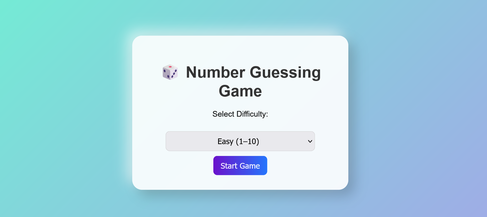
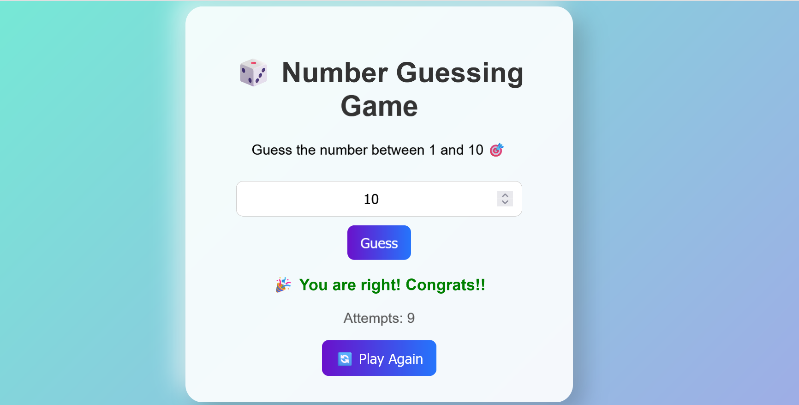

# Guessing-game-3D-view
# 🎲 Number Guessing Game (Upgraded)

An interactive, stylish, and upgraded **Number Guessing Game** built with **HTML, CSS, and JavaScript**.  
Now with difficulty levels, attempt counter, 3D UI effects, and a play-again option!  

---

## 🚀 Features  
- 🌟 Modern **3D glassy card design** with animations  
- 🎚️ **Difficulty Levels** → Easy (1–10), Medium (1–50), Hard (1–100)  
- 🔢 **Attempt Counter** → track how many tries you made  
- 🔄 **Play Again Button** → reset the game without refreshing  
- 🎨 Attractive colors, gradients, and hover effects  
- 📱 Responsive and lightweight  

---

## 🛠️ Technologies Used  
- **HTML5** → Structure  
- **CSS3** → Styling & 3D animations  
- **JavaScript (ES6)** → Game logic  

---

## 📂 Project Structure  
📁 Number-Guessing-Game
┣ 📄 index.html # Main HTML file
┣ 📄 style.css # Styling file
┣ 📄 guessing.js # Game logic
┣ 📄 README.md # Project documentation
┗ 📁 screenshots
┣ 📄 frontlook.png
┣ 📄 attempcount.png
┗ 📄 winner.png

yaml
Copy code

---

## 🎮 How to Play  
1. Open `index.html` in your browser.  
2. Select a **difficulty level** (Easy, Medium, Hard).  
3. Enter your guess and click **Guess**.  
4. The game will tell you if your guess is **too high** 📈 or **too low** 📉.  
5. Keep guessing until you find the correct number 🎉.  
6. View your **attempt count** and use **Play Again** 🔄 to restart.  

---

## 📸 Screenshot 

### 🏁 Front Page  
  

### 🔢 Attempts Counter  
  

### 🎉 Winning Screen  
  

---

## 📌 How to Run  
- Clone this repo or download the project:  
  ```bash
  git clone https://github.com/aishwaryash775/Guessing-game-3D-view.git
Open index.html in your browser ✅

⚡ Future Enhancements
🔊 Add sound effects (success/failure)

🏆 High score tracking

🎲 Animated dice roll for random number generation

📱 Fully optimized mobile-first design

